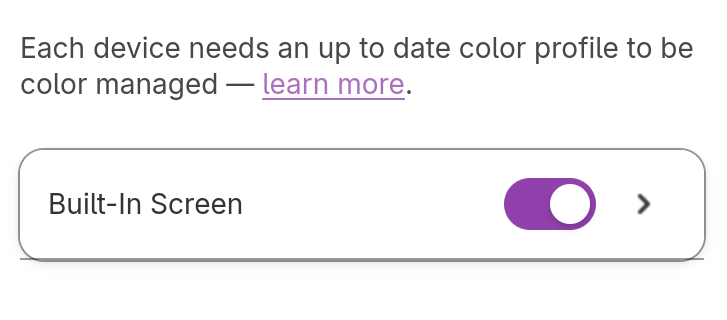
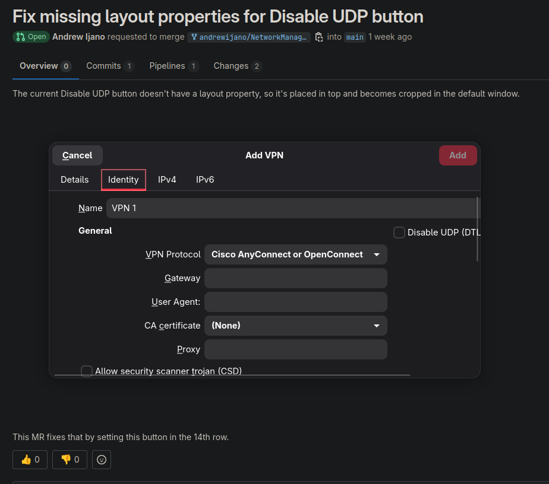
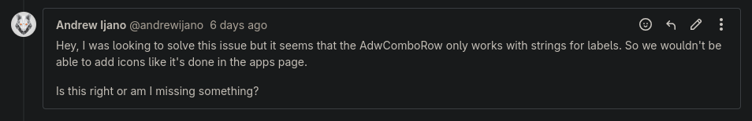

At the beggining I also teamed up with Andrew Ijano in order to tackle this assignment. We first started
asserting candidate issues we could contribute to.

### [Issue #1] Colors panel: there is an extra line below the device name
>[Issue 1644](https://gitlab.gnome.org/GNOME/gnome-control-center/-/issues/1644)

Andrew brought up this one. It was a very visible bug on the colors panel of the Settings app

Because of its simplicity, we thought it would be an easy fix; upon further investigation, we realized this was a problem with
Gtk itself. We read the discussion on the issue page, and saw that other contributors failed to fix it. We decided to look after other issues.

### [Issue #2] Network panel: connection editor too small when creating new VPN
>[Issue 2884](https://gitlab.gnome.org/GNOME/gnome-control-center/-/issues/2884)

For this problem, we tried to understand how this settings work. We identified that in the current version most of the problem was caused by a misplaced field in one type of VPN configurations. So, [we made a MR](https://gitlab.gnome.org/GNOME/NetworkManager-openconnect/-/merge_requests/76) to fix that, although the project itself seems abandoned.

### [Issue #3] Apps panel: can’t easily distinguish identically-named default apps without their icons
>[Issue 3378](https://gitlab.gnome.org/GNOME/gnome-control-center/-/issues/3378)

For the next issue, we tried to work on understand this problem. However, it seemed that the current Adwaita component didn’t support this feature, so we wouldn’t be able to fix that within the project. So, Andrew created a comment in the issue to alert about that.

